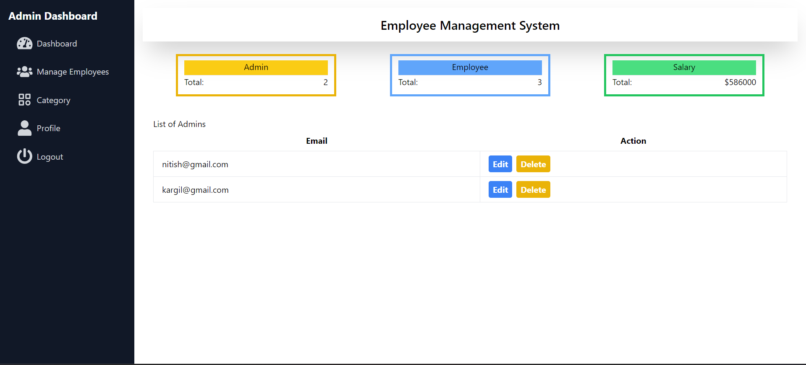
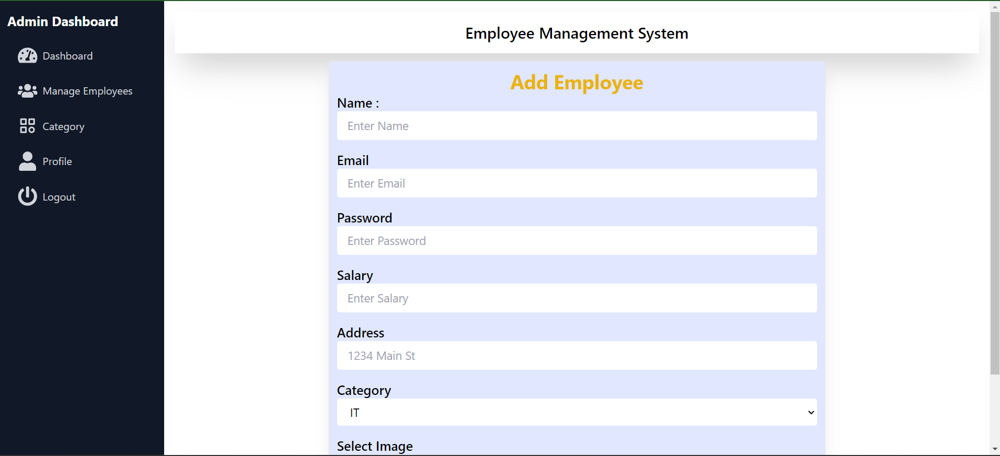

# Employee Management System

## Description

The Employee Management System is a web application designed to streamline and simplify the management of employee data. Admin users can add, edit, and delete employee details as needed. The system leverages a variety of modern technologies to ensure a smooth and efficient user experience.

## Technologies Used

- **Frontend:**
  - React
  - Axios
  - React Router dom
  - Tailwind CSS
  - JavaScript
  - Vite

- **Backend:**
  - Node.js
  - Express
  - Mysql
  - Multer
  - JWT (JSON Web Tokens)
  - Morgan

- **Storage:**
  - LocalStorage (for session management)

## Features

- **Admin Panel:**
  - Add new employee details.
  - Edit existing employee details.
  - Delete employees as needed.

- **Authentication:**
  - Secure login using JWT.
  - Session management using LocalStorage.

## Installation

### Prerequisites

Ensure you have the following installed on your machine:

- Node.js
- npm (Node Package Manager)

### Frontend Setup

1. Navigate to the frontend directory:
   ```bash
   cd client
   ```

2. Install dependencies:
   ```bash
   npm install
   ```

3. Start the development server:
   ```bash
   npm run dev
   ```

### Backend Setup

1. Navigate to the backend directory:
   ```bash
   cd server
   ```

2. Install dependencies:
   ```bash
   npm install
   ```

3. Start the server:
   ```bash
   npm run start
   ```

## Usage

1. Start both the frontend and backend servers as described in the installation section.
2. Open your browser and navigate to `http://localhost:3002` (or the port your frontend server is running on).
3. Log in using your admin credentials.
4. Use the admin panel to manage employee details.

## Preview

### Login Page


### Home Page



### Add Employee Section



## Contact

For any questions or suggestions, please contact us at [nitish.naroun123@gmail.com].

---